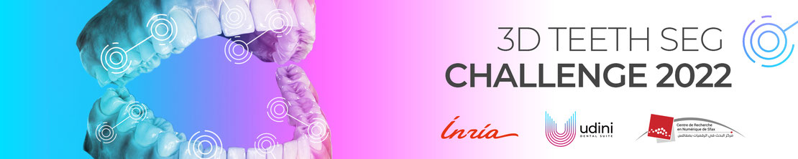
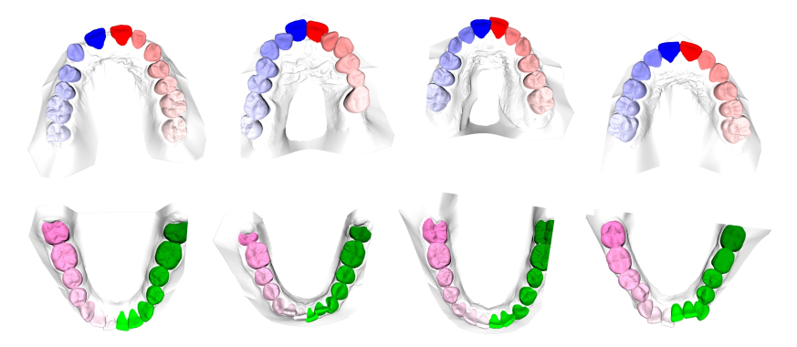
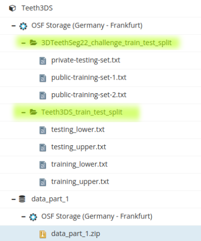

# 3D Teeth Scan Segmentation and Labeling Challenge
The challenge 3DTeethSeg22 is a first edition associated with MICCAI 2022. It is organized by [Udini](https://www.udini.ai/) (France) in collaboration with [Inria Grenoble Morpheo team](https://team.inria.fr/morpheo/) (France) and the [Digital Research Center of Sfax](http://www.crns.rnrt.tn/) (Tunisia).

## Description
Computer-aided design (CAD) tools have become increasingly popular in modern dentistry for highly accurate treatment 
planning. In particular, in orthodontic CAD systems, advanced intraoral scanners (IOSs) are now widely used as they 
provide precise digital surface models of the dentition. Such models can dramatically help dentists simulate teeth 
extraction, move, deletion, and rearrangement and ease therefore the prediction of treatment outcomes. Hence, 
digital teeth models have the potential to release dentists from otherwise tedious and time consuming tasks.

Although IOSs are becoming widespread in clinical dental practice, there are only few contributions on teeth
segmentation/labeling available in the literature and no publicly available database. A fundamental issue that 
appears with IOS data is the ability to reliably segment and identify teeth in scanned observations. 
Teeth segmentation and labeling is difficult as a result of the inherent similarities between teeth shapes as well 
as their ambiguous positions on jaws.

In addition, it faces several challenges:

 * The teeth position and shape variation across subjects.
 * The presence of abnormalities in dentition. For example, teeth crowding which results in teeth misalignment and thus non-explicit boundaries between neighboring teeth. Moreover, lacking teeth and holes are commonly seen among people.
Damaged teeth.
 * The presence of braces, and other dental equipment

 The challenge we propose will particularly focus on point 1, i.e. the teeth position and shape variation across subjects. With the extension of available data in the mid and long term, the other points will also be addressed in further editions of the challenge.


## Citing us

```
@article{ben20233dteethseg,
title={3DTeethSeg'22: 3D Teeth Scan Segmentation and Labeling Challenge},
author={Achraf Ben-Hamadou and Oussama Smaoui and Ahmed Rekik and Sergi Pujades and Edmond Boyer and Hoyeon Lim and Minchang Kim and Minkyung Lee and Minyoung Chung and Yeong-Gil Shin and Mathieu Leclercq and Lucia Cevidanes and Juan Carlos Prieto and Shaojie Zhuang and Guangshun Wei and Zhiming Cui and Yuanfeng Zhou and Tudor Dascalu and Bulat Ibragimov and Tae-Hoon Yong and Hong-Gi Ahn and Wan Kim and Jae-Hwan Han and Byungsun Choi and Niels van Nistelrooij and Steven Kempers and Shankeeth Vinayahalingam and Julien Strippoli and Aurélien Thollot and Hugo Setbon and Cyril Trosset and Edouard Ladroit},
journal={arXiv preprint arXiv:2305.18277},
year={2023}
}

@article{ben2022teeth3ds,
title={Teeth3DS: a benchmark for teeth segmentation and labeling from intra-oral 3D scans},
author={Ben-Hamadou, Achraf and Smaoui, Oussama and Chaabouni-Chouayakh, Houda and Rekik, Ahmed and Pujades, Sergi and Boyer, Edmond and Strippoli, Julien and Thollot, Aur{\'e}lien and Setbon, Hugo and Trosset, Cyril and others},
journal={arXiv preprint arXiv:2210.06094},
year={2022}
}
```

## Dataset details
### License

The data is provided under the [CC BY-NC-ND 4.0 License](https://creativecommons.org/licenses/by-nc-nd/4.0/)

### Data
A total of 1800 3D intra-oral scans have been collected for 900 patients covering their upper and lower jaws separately. 

The ground truth tooth labels and tooth instances for each vertex in the obj
files are provided in JavaScript Object Notation (JSON) format. A JSON file
example is shown below:
```python
{
    "id_patient": "6X24ILNE", 
    "jaw": "upper",
    "labels": [0, 0, 44, 33, 34, 0, 0, 45, 0, .. ,41,  0, 0, 37, 0, 34, 45, 0, 31, 36], 
    "instances": [0, 0, 10, 2, 12, 0, 0, 9, 0, 0, .. , 10, 0, 0, 8, 0, 0, 9, 0, 1, 8, 13],
}
```
The length of the tables ”labels” and ”instances” is the same as the total number of vertices in the corresponding 3D scan. The label and instance ”0” are
reserved by default for gingiva. And, other than ”0”, the unique numbers in table ”instances” indicate the number of teeth in the 3D scan.

The labels are provided in the FDI numbering system.


### Download

Dataset is structured under 6 data parts. It is required to download all of them and merge them to a same folder architecture.
1. url : https://osf.io/xctdy/

Two dataset train/test splits are provided , which specify the samples to consider for each dataset:
* 3D Teeth Seg Challenge split (used during the challenge)
* Teeth3DS official dataset split




## Evaluation
### Metrics
* Teeth localization accuracy (TLA):

calculated as the mean of normalized Euclidean distance between ground truth (GT) teeth centroids and the closest localized teeth centroid. 
Each computed Euclidean distance is normalized by the size of the corresponding GT tooth. 
In case of no centroid (e.g. algorithm crashes or missing output for a given scan) a nominal penalty of 5 per GT tooth 
will be given. This corresponds to a distance 5 times the actual GT tooth size. As the number of teeth per patient may
be variable, here the mean is computed over all gathered GT Teeth in the two testing sets.

* Teeth identification rate (TIR): 

is computed as the percentage of true identification cases relatively to all GT teeth in the two testing sets. A true identification is considered when for a given GT Tooth, the closest detected tooth centroid : is localized at a distance under half of the GT tooth size, and is attributed the same label as the GT tooth
* Teeth segmentation accuracy (TSA): 

is computed as the average F1-score over all instances of teeth point clouds. 
The F1-score of each tooth instance is measured as:
F1=2*(precision * recall)/(precision+recall)

**📌 NOTE:** Metrics calculation scripts are gathered in [evaluation.py](evaluation/evaluation.py)
### Leaderboard
| Team     | Method | Exp(-TLA)  | TSA        | TIR        | SCORE      | Github link |
|----------|--------|------------|------------|------------|------------|-------------|
| CGIP     |    | 0.9658     | **0.9859** | 0.9100     | **0.9539** |             |
| FiboSeg  |    | **0.9924** | 0.9293           | 0.9223     | 0.9480     |             |
| IGIP     |    |         0.9244    |  0.9750          | **0.9289** | 0.9427     |             |
| TeethSeg |    |      0.9184      |     0.9678       |       0.8538     | 0.9133     |             |
| OS       |    |      0.7845      |     0.9693       |        0.8940     | 0.8826     |             |
| Chompers |    |        0.6242     |         0.8886    |   0.8795         | 0.7974     |             |

## License 
The rest of this repository is under the [MIT License](https://choosealicense.com/licenses/mit/).

## Contact
For queries and issues not fit for a github issue, please email [Achraf Ben Hamadou](mailto:achraf.benhamadou@crns.rnrt.tn) .

